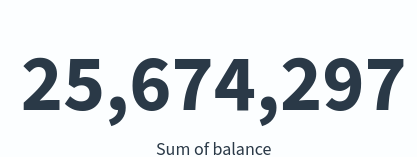
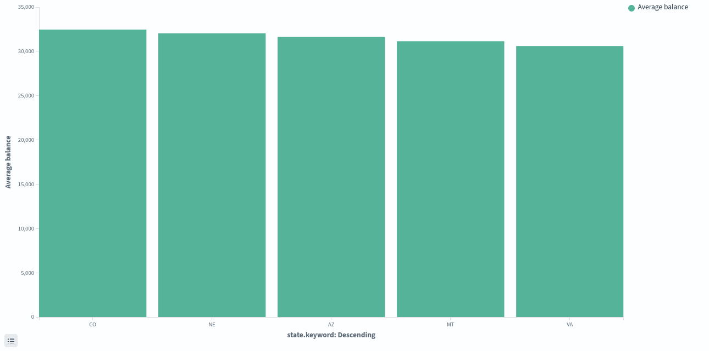
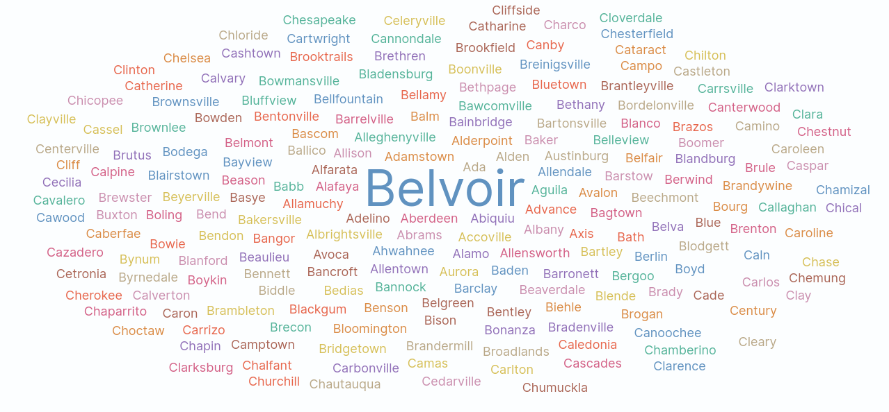
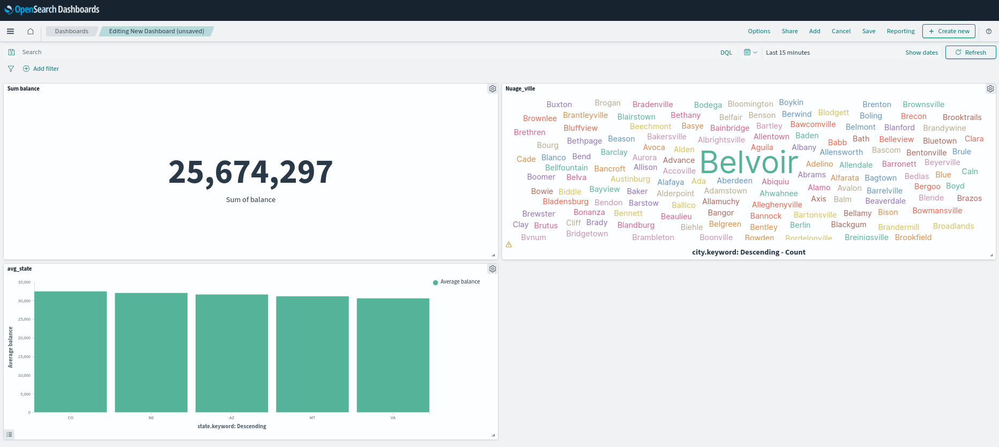
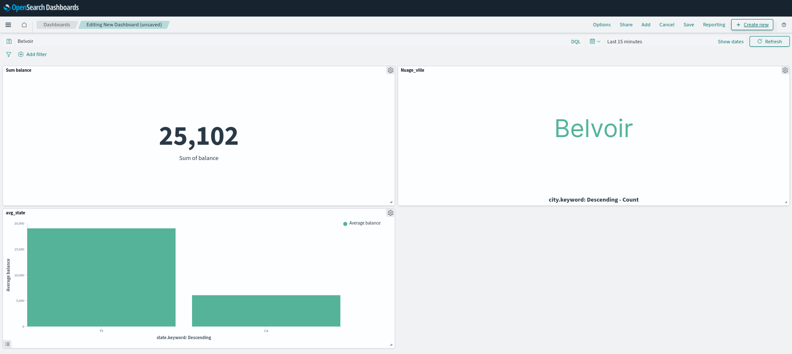

# Rendu 

# Partie 1 - Gestion de données simples
```
PUT bank/_doc/10001
{
  "firstname":"Pierrot",
  "lastname":"Random",
  "age":25
}
```
```
POST bank/_doc/10001
{
    "address":"Toulon"
}
```
```
GET bank/_doc/10001
```

```
DELETE bank/_doc/10001
```
```
POST /bank/_delete_by_query
{
  "query": {
    "match": {
      "city":"Nicholson"
    }
  }
}
```

```
GET bank/_doc/2
```
```
GET bank/_doc/2?_source
```
```
GET bank/_doc/2?_source=firstname,lastname
```

```http
GET bank/_search
```

```http
GET bank/_search
{
  "query": {
    "match": {
      "city": "Belvoir"
    }
  }
}
```

```http
GET bank/_search
{
    "query": {
        "bool": {
            "must": [
                {
                    "match": {
                        "city": "Belvoir"
                    }
                },
                {
                    "match": {
                        "employer": "Xurban"
                    }
                }
            ]
        }
    }
}
```




_Figure 1 —  Somme des comptes._




_Figure 2 —  Moyenne par états._





_Figure 3 — Ville ayant le plus comptes._


_Figure 4 — Dashboard avec les 3 visualisation_


_Figure 5 — Dashboard post rechercher_


# Partie 2 - Gestion de documents textuels


```
GET shakespeare/_search?q=play_name:KING^2 OR text_entry:KING
```

```
GET shakespeare/_search?q=speaker:CAESAR AND text_entry:Brutus
```


```
GET shakespeare/_search?q=speaker:CAESAR AND NOT text_entry:Brutus
```

```
GET shakespeare/_search?q=_all=caesar brutus calpurnia
```

Car il a une fréquence des mots recherchés moins élevé

```
GET shakespeare/_search?q=_all=caesar AND _all=brutus AND _all=calpurnia
```

```
GET shakespeare/_search?q=cesar
```
C'est une recherche au termes exacts

```
GET shakespeare/_search?q=cesar~
```

~ sert à  faire une recherche approaxive 

```
GET shakespeare/_search
{
  "size": 0,
  "aggs": {
    "unique_play_names": {
      "cardinality": {
        "field": "play_name.keyword"
      }
    }
  }
}
```

```
GET shakespeare/_search
{
  "size": 0,
  "aggs": {
    "by_play_name": {
      "terms": {
        "field": "play_name.keyword",  
        "size": 40
      },
      "aggs": {
        "line_count": {
          "value_count": {
            "field": "line_id"        
          }
        }
      }
    }
  }
}
```

# Partie 3 - Recherches sémantiques

"model_group_id": "_P5BppoBSat9PGtHtDmH",
  "task_id": "Df5wppoBSat9PGtHnzou",
model : Dv5wppoBSat9PGtHozp8
